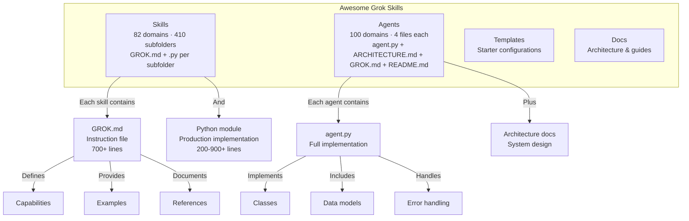
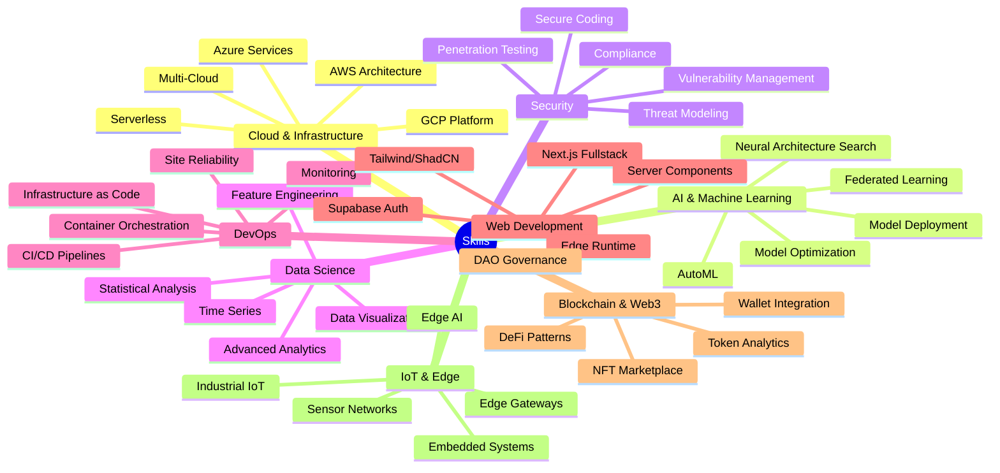
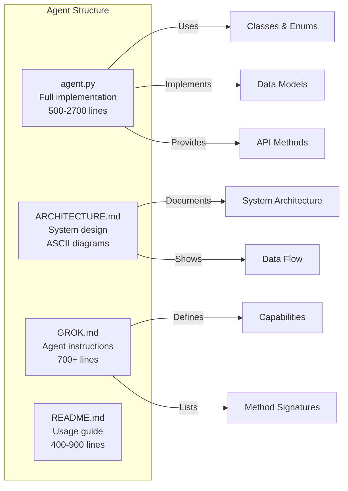
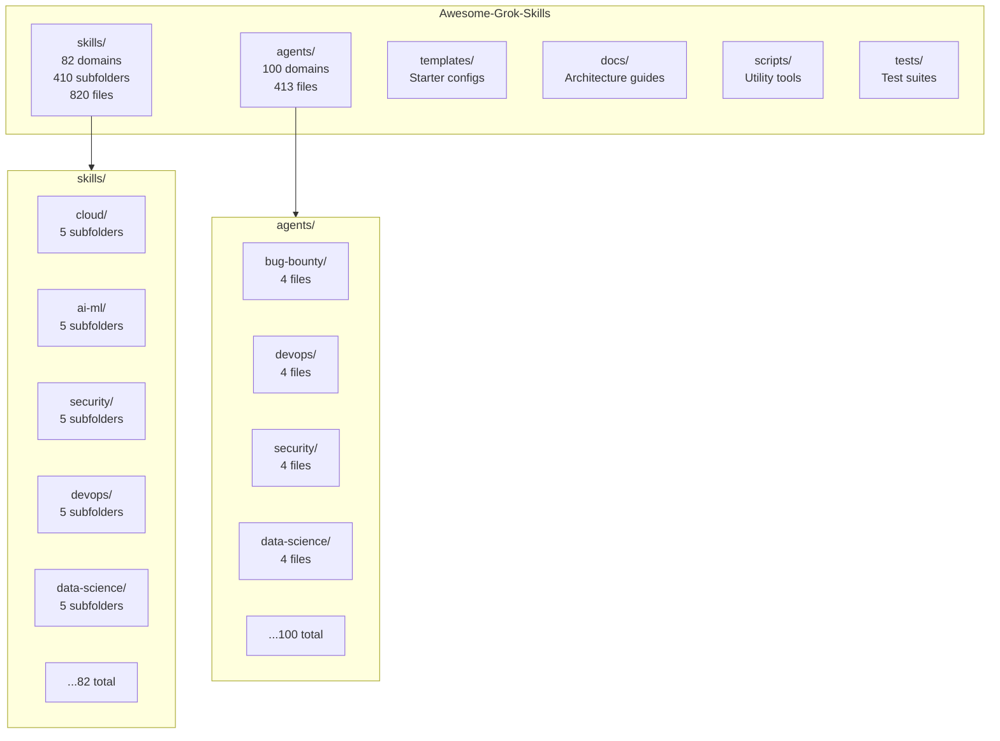
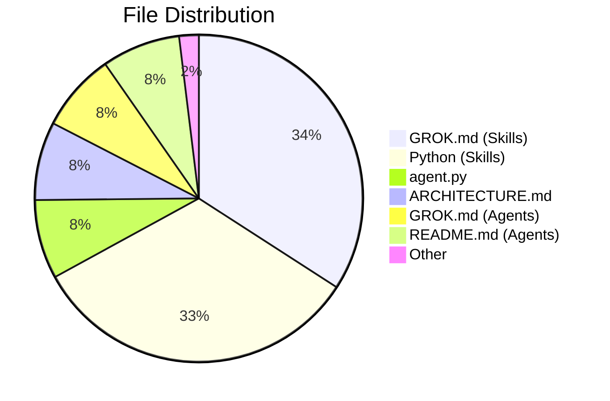
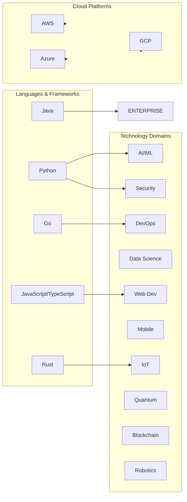

# Awesome Grok Skills

[](https://awesome.re)
[](https://opensource.org/licenses/MIT)
[](https://github.com/LifeJiggy/Awesome-Grok-Skills)
[](#skills)
[](#agents)
[](#repository-statistics)

> A comprehensive collection of 82 specialized skill domains and 100 intelligent agents, each with production-ready implementations and documentation, built for AI-powered development across every technology domain.

---

## Overview

Awesome Grok Skills is an open-source repository providing structured, composable skill definitions and autonomous agent implementations for AI-assisted software engineering. Each skill contains a GROK.md instruction file and a Python implementation module, organized into domain-specific categories covering the full modern technology stack.



---

## Skills

82 skill domains, each containing 5 specialized subfolders with a GROK.md instruction file and a Python implementation module.



### Skill Categories

| Category | Skills | Description |
|----------|--------|-------------|
| Cloud & Infrastructure | 5 | AWS, Azure, GCP, multi-cloud, serverless |
| AI & Machine Learning | 5 | NAS, optimization, federated learning, AutoML, deployment |
| Security | 5 | Pen testing, threat modeling, secure coding, compliance, vuln management |
| Data Science | 5 | Analytics, statistics, visualization, feature engineering, time series |
| DevOps | 5 | CI/CD, containers, IaC, monitoring, SRE |
| Web Development | 5 | Next.js, Supabase, Tailwind, server components, edge runtime |
| Blockchain & Web3 | 5 | DeFi, NFTs, tokens, wallets, DAOs |
| IoT & Edge | 5 | Embedded, industrial IoT, edge AI, sensors, gateways |
| Database | 5 | Administration, MongoDB, query optimization, modeling, replication |
| Networking | 5 | Load balancing, engineering, SDN, DNS, traffic analysis |
| Mobile | 5 | Android, iOS, React Native, Flutter, Expo |
| Enterprise | 5 | BI, CRM, data warehousing, ERP, workflow automation |
| Health Tech | 5 | Medical AI, EHR, telemedicine, monitoring, clinical data |
| Quantum | 5 | Computing, cryptography, optimization, simulation, networking |
| Robotics | 5 | Autonomous systems, vision, swarm, manipulation, navigation |
| And 67 more categories... | 335 | Covering every major technology domain |

### Skill Structure

Each skill follows a consistent structure:

```
skills/<category>/<skill-name>/
├── GROK.md          # 700+ line instruction file with YAML frontmatter
└── <skill_name>.py  # 200-900+ line Python implementation
```

**GROK.md** includes:
- YAML frontmatter (name, category, version, tags)
- Overview and core capabilities
- Usage examples with code
- Architecture patterns
- API reference and data models
- Configuration and deployment guides
- Security considerations
- Troubleshooting and best practices

**Python module** includes:
- Enums and dataclasses for type safety
- Full class implementations with methods
- Error handling and logging
- Type hints throughout
- Runnable `main()` demo function

---

## Agents

100 autonomous agents, each with a complete implementation and documentation suite.



### Agent Categories

| Category | Agents | Focus Areas |
|----------|--------|-------------|
| Security & Compliance | 12 | Bug bounty, red team, compliance audit, cloud audit, IAM, ethics |
| DevOps & Infrastructure | 10 | CI/CD, monitoring, backup, cloud migration, AWS/Azure specialists |
| Data & Analytics | 10 | Data science, engineering, quality, governance, architecture |
| Business & Marketing | 15 | Sales, marketing, content, SEO, brand management, affiliate |
| Development | 8 | Backend, frontend, API management, code review, debugging |
| Operations | 8 | Customer success, support, engagement, retention, localization |
| Research & Intelligence | 6 | Market research, competitive intel, competitive analysis |
| Specialized Domains | 12 | Healthcare, gaming, fintech, sustainability, real estate, physics |
| Planning & Strategy | 8 | Full-stack planning, agile coaching, change management |
| Technical Specialists | 14 | AI/ML, crypto, IoT, mobile, design, automation |

### Agent Capabilities

Each agent provides:

- **Autonomous execution** - Runs independently with configurable parameters
- **Domain expertise** - Deep knowledge in specific technology areas
- **Composable design** - Agents can be chained for complex workflows
- **Production-ready** - Error handling, logging, type safety, tests
- **Extensible** - Plugin architecture for custom extensions

---

## Repository Structure



---

## Quick Start

### Using Skills

```python
# Load a skill's instruction file
with open("skills/ai-ml/model-optimization/GROK.md") as f:
    instructions = f.read()

# Import and use the Python implementation
from skills.ai_ml.model_optimization import ModelOptimizer

optimizer = ModelOptimizer()
result = optimizer.optimize(model, dataset)
```

### Using Agents

```python
# Run an agent directly
python agents/data-science/agent.py

# Or import and use programmatically
from agents.data_science.agent import DataScienceAgent

agent = DataScienceAgent()
report = agent.analyze(dataset)
```

### Project Structure

```
my-project/
├── skills/                    # Reference skill definitions
│   ├── cloud/
│   │   ├── aws-architecture/
│   │   │   ├── GROK.md       # Instructions for AWS architecture
│   │   │   └── aws_architecture.py
│   │   └── ...
│   └── ...
├── agents/                    # Autonomous agent implementations
│   ├── data-science/
│   │   ├── agent.py
│   │   ├── ARCHITECTURE.md
│   │   ├── GROK.md
│   │   └── README.md
│   └── ...
└── ...
```

---

## Repository Statistics

| Metric | Count |
|--------|-------|
| Skill domains | 82 |
| Skill subfolders | 410 |
| Agent domains | 100 |
| Total files | 1,290+ |
| GROK.md files | 541 |
| Python modules | 526 |
| Architecture docs | 100 |
| README files | 100 |



---

## Technology Coverage



---

## Contributing

We welcome contributions. See [CONTRIBUTING.md](docs/CONTRIBUTING.md) for guidelines.

### Adding a Skill

1. Create a new directory under `skills/<category>/<skill-name>/`
2. Add `GROK.md` with YAML frontmatter and comprehensive documentation
3. Add `<skill_name>.py` with full implementation
4. Follow the existing structure and conventions

### Adding an Agent

1. Create a new directory under `agents/<agent-name>/`
2. Add `agent.py` with full implementation
3. Add `ARCHITECTURE.md` with system design documentation
4. Add `GROK.md` with agent instructions
5. Add `README.md` with usage guide

---

## License

MIT License - See [LICENSE](LICENSE) for details.

---

<div align="center">

**Built with precision. Powered by open source.**

[](https://awesome.re)

</div>
