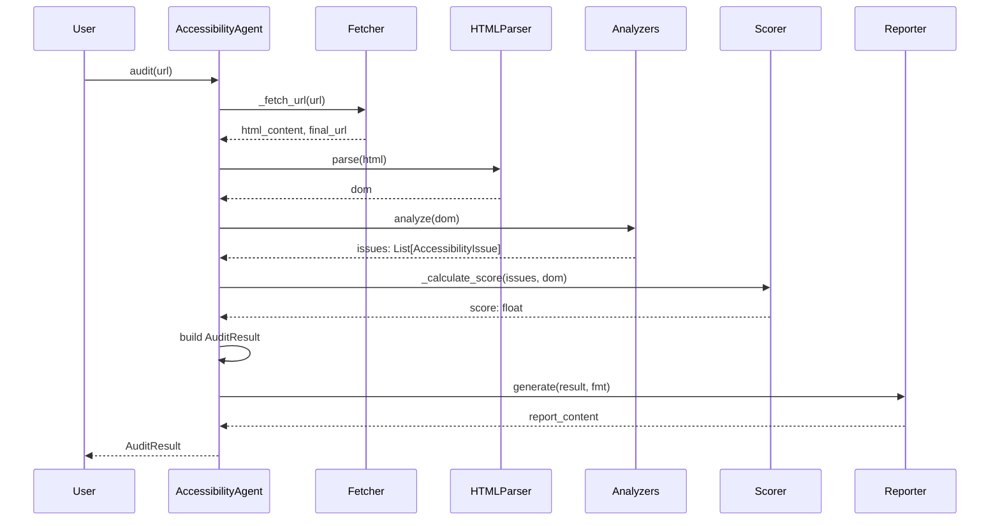
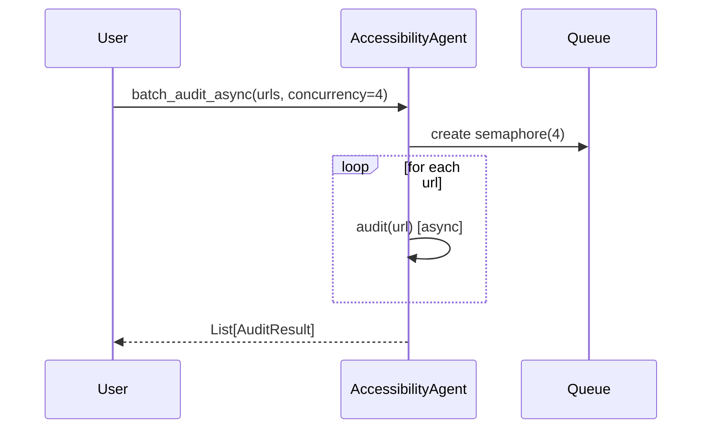

# Accessibility Agent Architecture

## Version

2.1.0

## Overview

The Accessibility Agent is a modular, production-grade auditing and remediation system built
around a pipeline of specialized analyzers, parsers, and formatters. It is designed to:

- Support multiple WCAG versions (2.0, 2.1, 2.2, 3.0) and Section 508.
- Integrate with external browsers/automation via pluggable fetch/parser backends.
- Scale via plugin-based rule extension and async batch processing.
- Produce actionable, multi-format reports and remediation plans.

This document describes the internal architecture, component responsibilities,
data contracts, and extension points of the agent.

---

---

## High-Level Architecture

```
┌─────────────────────────────────────────────────────────────────────────┐
│                         AccessibilityAgent (Facade)                      │
│  Owns Config, coordinates pipeline, exposes public API                  │
├─────────────────────────────────────────────────────────────────────────┤
│                                                                         │
│  ┌──────────────┐  ┌──────────────┐  ┌────────────────────────────┐   │
│  │ Config       │  │ AuditHistory │  │ PluginManager               │   │
│  │ (dataclass)  │  │ (JSON store) │  │ (extension runtime)         │   │
│  └──────┬───────┘  └──────┬───────┘  └────────────┬───────────────┘   │
│         │                  │                       │                   │
│         └──────────────────┴───────────────────────┘                   │
│                            │                                           │
│  ┌────────────────────────▼──────────────────────────────────────┐    │
│  │                      Analysis Pipeline                          │    │
│  │                                                                 │    │
│  │   Input (URL / HTML / file / stream)                            │    │
│  │        │                                                        │    │
│  │        ▼                                                        │    │
│  │  ┌─────────────────┐                                            │    │
│  │  │  Fetcher        │  (requests / urllib / custom backend)      │    │
│  │  └────────┬────────┘                                            │    │
│  │           │                                                     │    │
│  │           ▼                                                     │    │
│  │  ┌─────────────────┐                                            │    │
│  │  │  HTMLParser     │  -> DOMNode tree                           │    │
│  │  └────────┬────────┘                                            │    │
│  │           │                                                     │    │
│  │           ▼                                                     │    │
│  │  ┌─────────────────────────────────────────────────────────┐   │    │
│  │  │  Analyzers (enabled per Config)                          │   │    │
│  │  │  - SemanticAnalyzer                                      │   │    │
│  │  │  - ARIAAnalyzer                                          │   │    │
│  │  │  - KeyboardAnalyzer                                      │   │    │
│  │  │  - ColorAnalyzer                                         │   │    │
│  │  │  - Custom Plugins                                        │   │    │
│  │  └────────┬────────────────────────────────────────────────┘   │    │
│  │           │                                                     │    │
│  │           ▼                                                     │    │
│  │  ┌─────────────────────────────────────────────────────────┐   │    │
│  │  │  Issue Aggregation & Scoring                            │   │    │
│  │  └────────┬────────────────────────────────────────────────┘   │    │
│  │           │                                                     │    │
│  │           ▼                                                     │    │
│  │  ┌─────────────────────────────────────────────────────────┐   │    │
│  │  │  AuditResult                                            │   │    │
│  │  └─────────────────────────────────────────────────────────┘   │    │
│  │                                                                 │    │
│  └─────────────────────────────────────────────────────────────────┘    │
│                                                                         │
│  ┌──────────────────────────┐  ┌──────────────────────────────────┐    │
│  │ ReportGenerator          │  │ RemediationEngine                │    │
│  │ (HTML/MD/JSON/CSV/PDF/   │  │ (plan + fix generation)          │    │
│  │  JUnit)                  │  │                                  │    │
│  └──────────────────────────┘  └──────────────────────────────────┘    │
│                                                                         │
└─────────────────────────────────────────────────────────────────────────┘
```

---

---

## Core Components

### 1. `AccessibilityAgent` (Facade / Orchestrator)

**File**: `agent.py`

**Responsibilities**:
- Owns `Config` and initializes all subsystem components.
- Exposes primary user-facing APIs: `audit()`, `audit_html()`, `generate_report()`,
  `create_remediation_plan()`, `batch_audit()`, and integration converters.
- Coordinates end-to-end execution of the analysis pipeline.
- Manages plugin lifecycle and audit history persistence.
- Handles network fetch logic with retry and timeout.

**Public API Surface**:
- `audit(url) -> AuditResult`
- `audit_html(html, base_url) -> AuditResult`
- `generate_report(result, fmt, output_path) -> str`
- `create_remediation_plan(result) -> RemediationPlan`
- `apply_remediation(plan, dry_run) -> Dict`
- `batch_audit(urls) -> List[AuditResult]`
- `batch_audit_async(urls, concurrency) -> List[AuditResult]`
- `get_status() -> Dict`
- `get_history() -> List[Dict]`
- `compare_results(other) -> Dict`
- `to_lighthouse_format() -> Dict`
- `to_axe_core_format() -> Dict`
- `register_custom_plugin(plugin_class) -> None`

**Internal State**:
- `_config: Config`
- `_audit_count: int`
- `_last_audit: Optional[AuditResult]`
- `_parser: Optional[HTMLParser]`
- `_history: AuditHistory`
- `_plugin_manager: PluginManager`
- `_report_generator: ReportGenerator`
- `_remediation_engine: RemediationEngine`
- Sub-analyzers: `_color_analyzer`, `_aria_analyzer`, `_keyboard_analyzer`,
  `_semantic_analyzer`

---

### 2. `Config` (Configuration Dataclass)

**Responsibilities**:
- Centralize all tunable parameters.
- Provide `to_dict()` for serialization.
- Make the agent behavior reproducible across runs.

**Key Fields**:

| Field | Type | Default | Purpose |
|-------|------|---------|---------|
| `standard` | `str` | `"wcag2.1-aa"` | Shortcut standard string. |
| `wcag_version` | `WCAGVersion` | `WCAG_21` | Target WCAG version. |
| `wcag_level` | `WCAGLevel` | `AA` | Target conformance level. |
| `timeout` | `int` | `60` | HTTP fetch timeout (seconds). |
| `report_formats` | `List[ReportFormat]` | `[HTML, JSON, MARKDOWN]` | Output formats. |
| `output_directory` | `str` | `"./accessibility_reports"` | Report save path. |
| `history_enabled` | `bool` | `True` | Persist audit history. |
| `history_file` | `str` | `"accessibility_history.json"` | History file path. |
| `retention_days` | `int` | `90` | History retention window. |
| `concurrency` | `int` | `4` | Async batch concurrency limit. |
| `color_blindness_checks` | `bool` | `True` | Enable color blindness simulation. |
| `keyboard_navigation_checks` | `bool` | `True` | Enable keyboard analysis. |
| `aria_checks` | `bool` | `True` | Enable ARIA validation. |
| `semantic_checks` | `bool` | `True` | Enable semantic HTML checks. |
| `color_contrast_checks` | `bool` | `True` | Enable contrast analysis. |
| `heading_structure_checks` | `bool` | `True` | Enable heading hierarchy checks. |
| `link_text_checks` | `bool` | `True` | Enable link text quality checks. |
| `form_label_checks` | `bool` | `True` | Enable form label association checks. |
| `table_structure_checks` | `bool` | `True` | Enable table structure checks. |
| `landmark_checks` | `bool` | `True` | Enable landmark presence checks. |
| `focus_management_checks` | `bool` | `True` | Enable focus indicator checks. |
| `document_language_checks` | `bool` | `True` | Enable language attribute checks. |
| `skip_to_content_checks` | `bool` | `True` | Enable skip link checks. |
| `plugin_directories` | `List[str]` | `[]` | Directories containing plugins. |
| `auto_fix_enabled` | `bool` | `False` | Allow live remediation. |
| `max_auto_fixes_per_run` | `int` | `10` | Cap auto-fixes per plan apply. |
| `cache_results` | `bool` | `True` | Enable in-memory result caching. |
| `cache_ttl_hours` | `int` | `24` | Cache time-to-live. |
| `max_retries` | `int` | `3` | Fetch retry count. |
| `retry_delay_seconds` | `float` | `1.0` | Retry backoff delay. |
| `user_agent` | `str` | `"AccessibilityAgent/2.0"` | HTTP User-Agent. |
| `viewport_width` | `int` | `1280` | Simulated viewport width. |
| `viewport_height` | `int` | `720` | Simulated viewport height. |

---

### 3. `HTMLParser` & `DOMNode`

**Responsibilities**:
- Convert raw HTML into a traversable `DOMNode` tree.
- Preserve line numbers and XPath-like selectors for debugging.
- Support multiple backend parsers.

**Parser Selection**:
1. **BeautifulSoup** (`bs4`) - preferred for robustness.
2. **lxml** - faster, more permissive (optional integration).
3. **Fallback** - lightweight regex-based parser for minimal environments.

**`DOMNode` Contract**:
- `tag_name: str` - lowercase tag or `#document`.
- `attributes: Dict[str, str]` - HTML attributes.
- `text_content: str` - direct text (not descendant text).
- `children: List[DOMNode]` - child elements.
- `xpath: str` - generated path for locating the node.
- `line_number: int` - approximate line in source.
- `column_number: int` - approximate column in source.
- `is_self_closing: bool` - void element flag.
- `accessibility_data: Dict[str, Any]` - extensible metadata.

**Helper Methods**:
- `get(key, default) -> str`
- `has_attribute(key) -> bool`
- `to_dict() -> Dict`

**Selector Support**:
- `query_selector(css_like)` supports basic `#id`, `.class`, `tag[attr]`.

---

### 4. Analyzers

All analyzers share the same contract:
```python
def analyze(self, dom_node: DOMNode) -> List[AccessibilityIssue]:
    ...
```

#### 4.1 `SemanticAnalyzer`

Validates HTML semantics and structure.

**Checks**:
- **Heading hierarchy** (`_check_heading_hierarchy`) - ensures no skipped levels,
  exactly one `<h1>`.
- **Landmarks** (`_check_landmarks`) - requires `<main>` or `role="main"`.
- **Images** (`_check_images`) - alt text presence and appropriateness.
- **Forms** (`_check_forms`) - label association for inputs.
- **Links** (`_check_links`) - non-empty text, non-generic text (`click here`).
- **Tables** (`_check_tables`) - header cells and role presence.
- **Language** (`_check_language`) - `lang` attribute on `<html>`.
- **Title** (`_check_document_title`) - non-empty `<title>` in `<head>`.

**Data Flow**:
- Walks the DOM recursively.
- For each check, appends `AccessibilityIssue` with appropriate severity,
  category, and WCAG mapping.

#### 4.2 `ARIAAnalyzer`

Validates ARIA roles, states, and properties.

**Checks**:
- **Role validity** - cross-references against WAI-ARIA 1.2 spec.
- **Required states** - ensures required `aria-*` attributes per role.
- **Missing names** - interactive elements without accessible name.
- **Conflicts** - e.g., `aria-hidden` combined with `tabindex`.

**Data Structures**:
- `valid_roles` - set of all known ARIA roles.
- `required_states` - mapping of role -> required attributes.
- `global_aria_attrs` - attributes allowed on any element.

#### 4.3 `KeyboardAnalyzer`

Analyzes keyboard interaction patterns.

**Checks**:
- **Keyboard traps** (`_detect_keyboard_traps`) - dialogs without `aria-modal`.
- **Skip links** (`_check_skip_link`) - presence of skip-to-content anchor.
- **Focus indicators** (`_check_focus_indicators`) - inline `outline: none`.
- **Tab order** (`_check_tab_order`) - positive `tabindex` usage.
- **Click handlers** (`_check_click_handlers`) - `onclick` on non-focusable tags.

**Tabbable Detection**:
- Native: `a`, `button`, `input`, `select`, `textarea`, etc.
- Custom: elements with `tabindex >= 0`.

#### 4.4 `ColorAnalyzer`

Computes color-related accessibility metrics.

**Checks**:
- **Contrast ratio** - per WCAG relative luminance formula.
- **Large text classification** - 14pt bold or 18pt regular.
- **WCAG levels** - AA/AAA pass/fail thresholds.
- **Color blindness simulation** - Protanopia, Deuteranopia, Tritanopia,
  Achromatopsia using standard transformation matrices.

**Formulas**:
- Relative luminance: `0.2126 * R + 0.7152 * G + 0.0722 * B` (linearized).
- Contrast ratio: `(L1 + 0.05) / (L2 + 0.05)`.

---

### 5. Data Models

#### `AccessibilityIssue`

- `id: str` - unique identifier (hash-based or manual).
- `criterion: str` - WCAG criterion reference.
- `description: str` - human-readable issue description.
- `impact: str` - explanation of user impact.
- `elements: List[str]` - XPath selectors for affected nodes.
- `suggestion: str` - recommended fix.
- `severity: IssueSeverity` - CRITICAL / HIGH / MEDIUM / LOW.
- `category: IssueCategory` - e.g., `color-contrast`, `aria`.
- `wcag_level: WCAGLevel` - A / AA / AAA.
- `wcag_version: WCAGVersion` - 2.0 / 2.1 / 2.2 / 3.0 / section-508.
- `remediation_type: RemediationType` - fix category.
- `remediation_code: Optional[str]` - code snippet for fix.
- `confidence: float` - 0.0 to 1.0.
- `tags: List[str]` - free-form labels.

#### `AuditResult`

- `url: str` - audited URL.
- `score: float` - 0.0 to 100.0.
- `issues: List[AccessibilityIssue]`
- `timestamp: datetime`
- `metadata: Dict[str, Any]`
- `audit_duration_ms: int`
- `total_elements: int`
- `html_length: int`
- `standards_checked: List[str]`
- `browser: str` - simulated browser string.
- `viewport: Dict[str, int]`

**Derived Methods**:
- `issues_by_severity() -> Dict[IssueSeverity, List]`
- `issues_by_category() -> Dict[IssueCategory, List]`
- `critical_count()`, `high_count()`, `medium_count()`, `low_count()`
- `summary() -> str`

#### `ColorPair`

- `text_color: str`
- `background_color: str`
- `font_size: str`
- `font_weight: str`
- `element_selector: str`

**Methods**:
- `relative_luminance() -> float`
- `contrast_ratio() -> float`
- `simulate_color_blindness(ctype) -> ColorPair`

#### `RemediationPlan` / `RemediationStep`

- `RemediationStep`: `description`, `type`, `selector`, `code`, `priority`,
  `estimated_minutes`, `related_issues`.
- `RemediationPlan`: `result`, `steps`, `summary`, `total_estimated_minutes`,
  `generated_at`.

---

### 6. `RemediationEngine`

**Responsibilities**:
- Convert `AuditResult` into prioritized `RemediationPlan`.
- Support dry-run and live application of fixes.
- Maintain fix history.

**Core Methods**:
- `create_plan(result) -> RemediationPlan`
- `apply_plan(plan, dry_run) -> Dict`
- `generate_html_fixes(result) -> str`

**Sorting Strategy**:
1. Sort by `severity.score_penalty` descending.
2. Break ties by `-confidence` descending (more confident first).

**Effort Estimation**:
```python
estimated = min(15, max(2, int(issue.score_contribution() / 3)))
```

---

### 7. `ReportGenerator`

Generates reports in multiple formats.

| Format | Method | Output Type |
|--------|--------|-------------|
| HTML | `_generate_html` | Interactive, styled |
| Markdown | `_generate_markdown` | Plain text, GitHub-friendly |
| JSON | `AuditResult.to_json` | Structured data |
| CSV | `_generate_csv` | Spreadsheet rows |
| PDF | `_generate_pdf` | Placeholder (markdown) |
| JUnit XML | `_generate_junit_xml` | CI/CD test report |

**HTML Report Features**:
- Severity color coding.
- Summary cards.
- Code snippet blocks with syntax highlighting.
- Responsive layout.

**CSV Columns**:
`id`, `severity`, `category`, `criterion`, `description`, `impact`, `elements`,
`suggestion`, `wcag_version`, `wcag_level`.

---

### 8. `PluginManager`

Manages discovery, loading, and execution of audit plugins.

**Loading**:
- Scans configured directories for `.py` files.
- Inspects each module for `PluginBase` subclasses.
- Instantiates and registers valid plugins.

**Execution**:
- Runs each plugin's `analyze(dom_node, config)` method.
- Aggregates returned issues.
- Catches and logs exceptions per plugin to avoid cascade failures.

**Statistics**:
- Tracks issues found per plugin.
- Exposes `get_stats()` and `list_plugins()`.

---

### 9. `AuditHistory`

JSON-backed persistence layer.

**Structure**:
```json
[
  {
    "timestamp": "2026-06-03T14:30:00",
    "url": "https://example.com",
    "score": 85.0,
    "issues_count": 12,
    "critical": 2,
    "high": 4,
    "medium": 4,
    "low": 2
  }
]
```

**Methods**:
- `load()` / `save()` - file I/O.
- `add(result)` - append entry.
- `get_trend(urls=None) -> List[Dict]`
- `_prune()` - remove entries older than `retention_days`.

---

### 10. `PluginBase` (Abstract)

Contract for all plugins:

```python
class PluginBase(abc.ABC):
    @abc.abstractmethod
    def get_name(self) -> str: ...

    @abc.abstractmethod
    def get_version(self) -> str: ...

    @abc.abstractmethod
    def analyze(self, dom_node: DOMNode, config: Config) -> List[AccessibilityIssue]: ...
```

---

## Data Flow

```
┌────────────┐     ┌────────────┐     ┌────────────┐     ┌────────────┐
│   URL      │     │   HTML     │     │   File     │     │  Program   │
│ (string)   │────▶│ (string)   │────▶│ (path)     │────▶│  (stream)  │
└────────────┘     └────────────┘     └────────────┘     └────────────┘
                                                        │
                                                        ▼
                                                ┌─────────────────┐
                                                │  Fetcher /      │
                                                │  HTMLParser     │
                                                └────────┬────────┘
                                                         │
                                                         ▼
                                                ┌─────────────────┐
                                                │  DOMNode tree   │
                                                └────────┬────────┘
                                                         │
                                   ┌─────────────────────┼─────────────────────┐
                                   ▼                     ▼                     ▼
                            ┌──────────────┐     ┌──────────────┐     ┌──────────────┐
                            │ Semantic     │     │ ARIA         │     │ Keyboard     │
                            │ Analyzer     │     │ Analyzer     │     │ Analyzer     │
                            └──────┬───────┘     └──────┬───────┘     └──────┬───────┘
                                   │                     │                     │
                                   ▼                     ▼                     ▼
                            ┌──────────────┐     ┌──────────────┐     ┌──────────────┐
                            │ Color        │     │ Plugins      │     │ (enabled     │
                            │ Analyzer     │     │ (custom)     │     │  selectively)│
                            └──────┬───────┘     └──────┬───────┘     └──────┬───────┘
                                   │                     │                     │
                                   └─────────────────────┼─────────────────────┘
                                                         │
                                                         ▼
                                                ┌─────────────────┐
                                                │  Accessibility  │
                                                │  Issue list     │
                                                └────────┬────────┘
                                                         │
                                                         ▼
                                                ┌─────────────────┐
                                                │  Score calc:    │
                                                │  100 - sum(p)   │
                                                └────────┬────────┘
                                                         │
                                                         ▼
                                                ┌─────────────────┐
                                                │  AuditResult    │
                                                └────────┬────────┘
                                                         │
                                    ┌────────────────────┼────────────────────┐
                                    ▼                    ▼                    ▼
                             ┌──────────────┐     ┌──────────────┐     ┌──────────────┐
                             │ Report       │     │ Remediation  │     │ History      │
                             │ Generator    │     │ Plan         │     │ Persistence  │
                             └──────────────┘     └──────────────┘     └──────────────┘
```

---

## Sequence Diagrams

### URL Audit Flow



### Batch Audit Flow



---

---

## Configuration Reference

### YAML Configuration File Example

```yaml
standard: "wcag2.1-aa"
wcag_version: "2.1"
wcag_level: "aa"

analyzers:
  aria_checks: true
  keyboard_navigation_checks: true
  semantic_checks: true
  color_contrast_checks: true
  heading_structure_checks: true
  link_text_checks: true
  form_label_checks: true
  table_structure_checks: true
  landmark_checks: true
  focus_management_checks: true
  document_language_checks: true
  skip_to_content_checks: true
  media_checks: true

color_blindness_checks: true
simulate_screen_reader: false

reporting:
  generate_report: true
  report_formats:
    - "html"
    - "json"
    - "markdown"
  output_directory: "./accessibility_reports"

history:
  enabled: true
  file: "accessibility_history.json"
  retention_days: 90

performance:
  concurrency: 4
  cache_results: true
  cache_ttl_hours: 24
  max_retries: 3
  retry_delay_seconds: 1.0

remediation:
  auto_fix_enabled: false
  max_auto_fixes_per_run: 10
  backup_before_fix: true

plugins:
  directories:
    - "./accessibility_plugins"
  custom_rules: []

networking:
  timeout: 60
  user_agent: "AccessibilityAgent/2.0"
  viewport_width: 1280
  viewport_height: 720
```

---

---

## Performance Characteristics

| Metric | Complexity | Notes |
|--------|-----------|-------|
| HTML parse | O(N) | Linear with BeautifulSoup; near-linear fallback |
| DOM traversal | O(N) | Each analyzer walks the tree |
| Analyzer CPU | O(N * A) | N = nodes, A = active analyzers |
| Scoring | O(I) | I = number of issues |
| Report generation | O(I * F) | F = number of output formats |
| Batch audit (seq) | O(U * (N + A + I + F)) | U = URLs |
| Batch audit (async) | O(U / concurrency) * per-URL cost | network-bound |

**Memory**:
- DOM tree: O(N) nodes.
- Issues list: O(I).
- History: capped by `retention_days`.

**Recommended Tuning**:
- For large pages: reduce `max_issues_per_category`.
- For CI: disable history, limit formats to JSON/JUnit.
- For batch scans: increase `concurrency` up to network capacity.

---

---

## Security & Privacy

### Threat Model

| Threat | Mitigation |
|--------|-----------|
| SSRF via `audit(url)` | Validate URLs; restrict to allowed domains in CI. |
| Unbounded memory | Cap `max_issues_per_category`; prune history. |
| Plugin code execution | Treat plugins as trusted code; sandbox at OS level. |
| Log injection | Avoid logging raw DOM without sanitization. |
| DoS via slow responses | Enforce `timeout` and `max_retries`. |

### Data Handling

- No secrets or credentials are logged by default.
- Reports may contain DOM text; redact PII before external sharing.
- HTTP fetches do not send cookies or auth headers by default.

---

---

## Extension Points

### 1. Custom Rule Plugins

Implement `PluginBase` and drop into `plugin_directories`.

### 2. Fetch Backends

Extend `_fetch_url()` to support authenticated crawlers, headless browsers,
or authenticated API proxies.

### 3. HTML Parsers

Add adapters for `lxml`, `selectolax`, `playwright`, or `puppeteer`.

### 4. Report Formats

Add methods to `ReportGenerator` and map them in `generate()`.

### 5. Remediation Backends

Implement file patching, PR creation, or Git branch management in
`RemediationEngine`.

---

---

## Reliability & Error Handling

- Each analyzer isolates failures; exceptions do not abort the audit.
- HTML parsing falls back gracefully when optional libraries are missing.
- Network fetch retries up to `max_retries` with `retry_delay_seconds` backoff.
- History and report writers use defensive file I/O with exception swallowing for
  transient filesystem errors.
- Plugin execution errors are logged and do not affect other plugins or analyzers.

---

---

## Deployment Considerations

### Container Deployment

```dockerfile
FROM python:3.12-slim
COPY . /app
RUN pip install beautifulsoup4 lxml
CMD ["python", "-m", "agents.accessibility.agent", "https://example.com"]
```

### CI/CD Usage

```yaml
- name: Accessibility Audit
  run: |
    python -m agents.accessibility.agent ./dist/index.html \
      --format junit \
      --output ./junit-a11y.xml
```

### Library Usage

```python
from agents.accessibility.agent import AccessibilityAgent, Config, ReportFormat

config = Config(generate_report=False, history_enabled=False)
agent = AccessibilityAgent(config)
result = agent.audit_html(html)
assert result.score >= 90
```

---

---

## Monitoring & Observability

- `get_status()` returns audit count, plugins loaded, last score.
- `AuditResult.audit_duration_ms` provides per-run latency.
- `AuditHistory` supports trend queries for dashboarding.
- Structured logging via `logging.getLogger(__name__)`.

---

---

## Glossary

- **DOM**: Document Object Model - tree representation of HTML.
- **WCAG**: Web Content Accessibility Guidelines.
- **ARIA**: Accessible Rich Internet Applications.
- **XPath**: XML Path Language - selector syntax for DOM nodes.
- **Contrast Ratio**: Ratio of relative luminance of lighter/darker colors.
- **Color Blindness**: Vision deficiency types: Protanopia, Deuteranopia,
  Tritanopia, Achromatopsia.
- **Skip Link**: Hidden-by-default link to jump to main content.
- **Keyboard Trap**: Element that captures keyboard focus without escape.
- **Landmark**: ARIA region role for navigation (`main`, `navigation`, etc.).
- **Remediation Plan**: Prioritized list of fixes with effort estimates.
