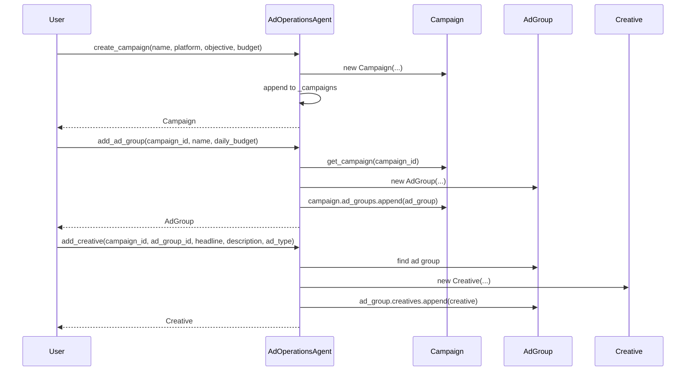
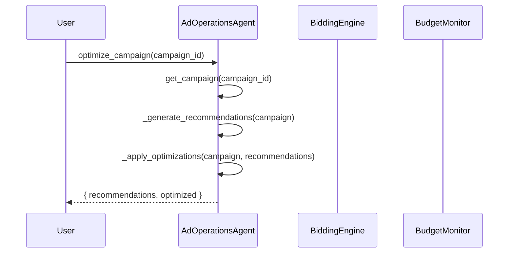
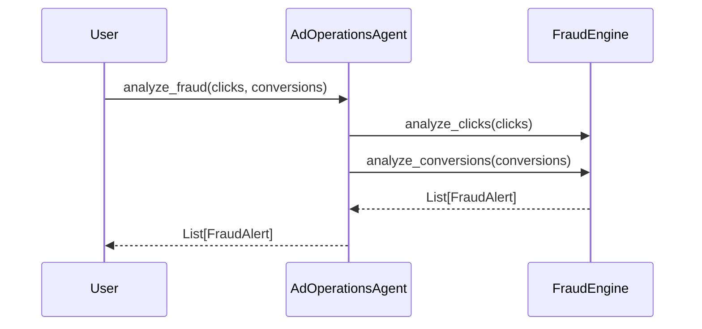

# AdOperations Agent Architecture

## Version

2.1.0

## Overview

The AdOperations Agent is a modular, production-grade system for digital advertising
campaign management, budget optimization, performance measurement, and reporting.
It is designed to:

- Support multiple ad platforms and campaign objectives.
- Model bids, budgets, and audience targets explicitly.
- Detect invalid traffic and pacing anomalies.
- Generate multi-format performance reports.
- Scale via batch operations, history tracking, and async report generation.

This document describes the internal architecture, component responsibilities,
data contracts, and extension points of the agent.

---

---

## High-Level Architecture

```
┌─────────────────────────────────────────────────────────────────────────┐
│                         AdOperationsAgent (Facade)                       │
│  Owns Config, coordinates pipeline, exposes public API                  │
├─────────────────────────────────────────────────────────────────────────┤
│                                                                         │
│  ┌──────────────┐  ┌──────────────┐  ┌────────────────────────────┐   │
│  │ Config       │  │ Alert Store  │  │ History / Audit Log         │   │
│  │ (dataclass)  │  │ (in-memory)  │  │ (append-only)               │   │
│  └──────┬───────┘  └──────┬───────┘  └────────────┬───────────────┘   │
│         │                  │                       │                   │
│         └──────────────────┴───────────────────────┘                   │
│                            │                                           │
│  ┌────────────────────────▼──────────────────────────────────────┐    │
│  │                      Campaign Lifecycle                          │    │
│  │                                                                 │    │
│  │   Input (campaign brief / platform API payload)                 │    │
│  │        │                                                        │    │
│  │        ▼                                                        │    │
│  │  ┌─────────────────┐                                            │    │
│  │  │  Campaign Build │  -> Campaign / AdGroup / Creative models    │    │
│  │  └────────┬────────┘                                            │    │
│  │           │                                                     │    │
│  │           ▼                                                     │    │
│  │  ┌─────────────────────────────────────────────────────────┐   │    │
│  │  │  Optimization Loop                                      │   │    │
│  │  │  - BiddingEngine                                         │   │    │
│  │  │  - BudgetPacingMonitor                                   │   │    │
│  │  │  - ABTestManager                                         │   │    │
│  │  └────────┬────────────────────────────────────────────────┘   │    │
│  │           │                                                     │    │
│  │           ▼                                                     │    │
│  │  ┌─────────────────────────────────────────────────────────┐   │    │
│  │  │  Fraud Detection                                         │   │    │
│  │  │  - FraudDetectionEngine                                  │   │    │
│  │  └────────┬────────────────────────────────────────────────┘   │    │
│  │           │                                                     │    │
│  │           ▼                                                     │    │
│  │  ┌─────────────────────────────────────────────────────────┐   │    │
│  │  │  Reporting                                               │   │    │
│  │  │  - ReportingEngine                                       │   │    │
│  │  └─────────────────────────────────────────────────────────┘   │    │
│  │                                                                 │    │
│  └─────────────────────────────────────────────────────────────────┘    │
│                                                                         │
└─────────────────────────────────────────────────────────────────────────┘
```

---

---

## Core Components

### 1. `AdOperationsAgent` (Facade / Orchestrator)

**Responsibilities**:
- Owns `Config` and initializes all subsystem components.
- Exposes user-facing APIs for campaign CRUD, optimization, reporting, and fraud checks.
- Coordinates the campaign lifecycle from creation through reporting.
- Maintains in-memory history for audit and trend analysis.

**Public API Surface**:
- `create_campaign(...) -> Campaign`
- `get_campaign(campaign_id) -> Optional[Campaign]`
- `pause_campaign`, `resume_campaign`, `archive_campaign`
- `add_ad_group(...) -> AdGroup`
- `add_creative(...) -> AdCreative`
- `optimize_campaign(campaign_id) -> Dict`
- `optimize_budget(campaign_ids) -> Dict[str, float]`
- `calculate_recommended_bid(...) -> float`
- `batch_audit(campaign_ids) -> List[Dict]`
- `generate_report(...) -> str`
- `get_metrics_summary(...) -> Dict`
- `analyze_fraud(clicks, conversions) -> List[FraudSignal]`
- `create_ab_test(...) -> ABTestResult`
- `get_alerts() -> List[PerformanceAlert]`

**Internal State**:
- `_config: Config`
- `_campaigns: List[Campaign]`
- `_alerts: List[PerformanceAlert]`
- `_history: List[Dict[str, Any]]`
- Subsystems: `_fraud_engine`, `_bidding_engine`, `_reporting_engine`,
  `_ab_test_manager`, `_budget_monitor`

---

### 2. `Config` (Configuration Dataclass)

**Responsibilities**:
- Centralize platform, bidding, fraud, reporting, and alerting settings.
- Provide `to_dict()` for serialization and replication.

**Key Fields**:

| Field | Type | Default | Purpose |
|-------|------|---------|---------|
| `default_platform` | `str` | `"google"` | Default ad platform. |
| `default_objective` | `str` | `"conversions"` | Default campaign objective. |
| `auto_optimize` | `bool` | `True` | Enable auto-optimization. |
| `budget_limit` | `float` | `1000.0` | Global budget cap. |
| `daily_budget_cap` | `float` | `500.0` | Default daily budget cap. |
| `max_bid` | `float` | `10.0` | Maximum bid allowed. |
| `min_bid` | `float` | `0.1` | Minimum bid allowed. |
| `default_bidding_strategy` | `str` | `"target_cpa"` | Default bidding strategy. |
| `target_cpa` | `float` | `25.0` | Target cost per acquisition. |
| `target_roas` | `float` | `4.0` | Target return on ad spend. |
| `fraud_detection_enabled` | `bool` | `True` | Enable fraud detection. |
| `fraud_confidence_threshold` | `float` | `0.8` | Minimum fraud confidence. |
| `budget_pacing_alert_threshold` | `float` | `0.8` | Overspend alert ratio. |
| `ab_test_significance_threshold` | `float` | `0.95` | Statistical significance threshold. |
| `report_formats` | `List[str]` | `["html", "json", "csv"]` | Output formats. |
| `output_directory` | `str` | `"./ad_ops_reports"` | Report output path. |
| `retention_days` | `int` | `90` | History retention window. |
| `concurrency` | `int` | `5` | Batch operation concurrency. |

---

### 3. Campaign Data Model

The campaign model is hierarchical:

```
Campaign
 └─ AdGroup (1..N)
      ├─ BiddingConfig
      ├─ AudienceSegment (0..N)
      ├─ Device bid modifiers
      └─ AdCreative (0..N)
```

**`Campaign`**:
- Top-level entity with platform, objective, status, budget, dates.
- Derived metrics: `ctr()`, `cpc()`, `cpa()`, `roas()`.
- Contains `ad_groups`, `tags`, `metrics`.

**`AdGroup`**:
- Named collection of creatives within a campaign.
- Owns `bidding`, `audience_segments`, device modifiers.
- Contains `creatives`.

**`AdCreative`**:
- Individual ad asset with headline, description, type, status.
- Derived metrics: `ctr()`, `cpc()`, `conversion_rate()`.

**`BiddingConfig`**:
- Strategy, target CPA/ROAS, daily/lifetime budget, bid adjustments.

**`AudienceSegment`**:
- Targeting specification with type, size, bid modifier, platform.

---

### 4. `FraudDetectionEngine`

Detects suspicious ad activity and invalid traffic.

**Strategies**:
- **High-frequency IP clicking** - bot-like patterns from single IPs.
- **Duplicate user agents** - repeated traffic from identical UAs.
- **Conversion stuffing** - rapid conversion bursts indicating fraud.
- **Unusual amount distribution** - statistical outliers in conversion values.

**Data Structures**:
- `_detected_signals: List[FraudSignal]`
- `_blacklisted_ips: Set[str]`
- `_blacklisted_agents: Set[str]`

**Public Methods**:
- `analyze_clicks(clicks) -> List[FraudAlert]`
- `analyze_conversions(conversions) -> List[FraudAlert]`
- `get_alerts(resolved=False) -> List[FraudAlert]`
- `resolve_alert(alert_id, notes) -> bool`

---

### 5. `BiddingEngine`

Calculates and optimizes bids and budget allocation.

**Bid Calculation**:
- Default: based on target CPA/ROAS and device modifiers.
- Optimized: adjusts using historical performance data.

**Budget Allocation**:
- Weighted scoring across campaigns using ROAS and CPA efficiency.
- Jitter to avoid deterministic allocation patterns.

**History**:
- `_bid_history` for learning and optimization.

---

### 6. `BudgetPacingMonitor`

Monitors daily spend pacing and generates alerts.

**Logic**:
- Tracks spend by campaign by day.
- Compares current spend to expected pace (hour_of_day / 24).
- Generates overspend CRITICAL alerts and underspend WARNING alerts.

**Forecast**:
- `get_spend_forecast(campaign_id, days_ahead)` - simple moving average.

---

### 7. `ABTestManager`

Manages A/B tests for ad creatives and campaign settings.

**State**:
- `_tests: Dict[str, ABTestResult]` - completed/in-progress results.
- `_active_tests: Dict[str, Dict]` - running test counters.

**Statistical Method**:
- Chi-squared approximation on pooled conversion rate.
- Confidence level and p-value calculation.
- Winner determination based on significance threshold.

**Lifecycle**:
- `create_test()` - initialize.
- `record_observation()` - accumulate impressions/conversions.
- `complete_test()` - finalize and compute statistics.

---

### 8. `ReportingEngine`

Generates multi-format performance reports.

**Formats**:
- HTML: styled dashboard with summary cards and tables.
- JSON: structured data with campaign details and summary.
- CSV: spreadsheet-ready rows of campaign-level metrics.
- PDF: placeholder (delegates to JSON or external library).

**Scheduling**:
- `schedule_report()` persists schedule metadata to JSON file.
- Supports cron expressions and recipient lists.

---

### 9. Data Models

#### `Campaign`

- `id: str`
- `name: str`
- `platform: AdPlatform`
- `objective: CampaignObjective`
- `status: CampaignStatus`
- `budget: BiddingConfig`
- `ad_groups: List[AdGroup]`
- `total_budget: float`
- `spent: float`
- `impressions: int`
- `clicks: int`
- `conversions: int`
- `revenue: float`
- `metrics: Dict[str, float]`
- `tags: List[str]`

#### `AdGroup`

- `id: str`
- `name: str`
- `campaign_id: str`
- `status: CampaignStatus`
- `bidding: BiddingConfig`
- `creatives: List[AdCreative]`
- `target_cpa: Optional[float]`
- `audience_segments: List[AudienceSegment]`
- `device_bid_modifiers: Dict[DeviceType, float]`
- `location_targets: List[str]`

#### `AdCreative`

- `id: str`
- `headline: str`
- `description: str`
- `ad_type: AdType`
- `platform: AdPlatform`
- `status: AdStatus`
- `image_url`, `video_url`, `final_url`
- `metrics: Dict[str, float]`
- `ab_test_variant: str`

#### `FraudSignal`

- `signal_id: str`
- `campaign_id: str`
- `ad_id: str`
- `signal_type: str`
- `confidence: float`
- `description: str`
- `detected_at: datetime`
- `is_resolved: bool`

#### `PerformanceAlert`

- `alert_id: str`
- `campaign_id: str`
- `severity: AlertSeverity`
- `message: str`
- `metric: str`
- `current_value: float`
- `threshold: float`
- `triggered_at: datetime`
- `is_acknowledged: bool`

#### `ABTestResult`

- `test_id: str`
- `variant_a`, `variant_b: str`
- `metric: str`
- `sample_size_a`, `sample_size_b: int`
- `conversion_rate_a`, `conversion_rate_b: float`
- `p_value: float`
- `confidence_level: float`
- `is_significant: bool`
- `winner: Optional[str]`
- `recommendation: str`

---

### 10. Enumerations

| Enum | Purpose |
|------|---------|
| `AdPlatform` | GOOGLE, FACEBOOK, LINKEDIN, TWITTER, TIKTOK, PROGRAMMATIC, DISPLAY, SEARCH, SOCIAL, NATIVE |
| `CampaignObjective` | AWARENESS, TRAFFIC, CONVERSIONS, SALES, LEAD_GENERATION, APP_INSTALLS, VIDEO_VIEWS, ENGAGEMENT, CATALOG_SALES, BRAND_RECONSIDERATION, STORE_VISITS |
| `CampaignStatus` | DRAFT, PENDING_REVIEW, ACTIVE, PAUSED, ARCHIVED, REMOVED, DISAPPROVED |
| `BiddingStrategy` | LOWEST_COST, TARGET_CPA, TARGET_ROAS, MAXIMIZE_CONVERSIONS, MANUAL_CPC, etc. |
| `AdStatus` | ENABLED, PAUSED, REMOVED, PENDING_REVIEW, DISAPPROVED |
| `AdType` | TEXT, IMAGE, VIDEO, CAROUSEL, COLLECTION, RESPONSIVE_SEARCH, SHOPPING, etc. |
| `AudienceType` | CUSTOM, LOOKALIKE, INTEREST, BEHAVIORAL, GEO, DEMOGRAPHIC, RETARGETING, IN_MARKET, LIFE_EVENT |
| `DeviceType` | MOBILE, DESKTOP, TABLET, CONNECTED_TV, UNKNOWN |
| `AlertSeverity` | INFO, WARNING, CRITICAL, EMERGENCY |
| `ReportGranularity` | HOURLY, DAILY, WEEKLY, MONTHLY, QUARTERLY, LIFETIME |

---

## Data Flow

```
┌────────────┐     ┌────────────┐     ┌────────────┐     ┌────────────┐
│ Campaign   │     │  AdGroup   │     │  Creative  │     │  Tracking  │
│   Brief    │────▶│ Definition │────▶│  Assets    │────▶│  Events    │
└────────────┘     └────────────┘     └────────────┘     └────────────┘
                                                        │
                                                        ▼
                                                ┌─────────────────┐
                                                │  Fraud /        │
                                                │  Pacing Monitor │
                                                └────────┬────────┘
                                                         │
                                   ┌─────────────────────┼─────────────────────┐
                                   ▼                     ▼                     ▼
                            ┌──────────────┐     ┌──────────────┐     ┌──────────────┐
                            │ Bidding      │     │ A/B Test     │     │ Alerting     │
                            │ Engine       │     │ Manager      │     │ & Anomaly    │
                            └──────┬───────┘     └──────┬───────┘     └──────┬───────┘
                                   │                     │                     │
                                   └─────────────────────┼─────────────────────┘
                                                         │
                                                         ▼
                                                ┌─────────────────┐
                                                │  Campaign       │
                                                │  Metrics        │
                                                └────────┬────────┘
                                                         │
                                    ┌────────────────────┼────────────────────┐
                                    ▼                    ▼                    ▼
                             ┌──────────────┐     ┌──────────────┐     ┌──────────────┐
                             │ HTML Report  │     │ JSON Export  │     │ CSV Export   │
                             └──────────────┘     └──────────────┘     └──────────────┘
```

---

## Sequence Diagrams

### Campaign Creation Flow



### Optimization Flow



### Fraud Analysis Flow



---

## Configuration Reference

### YAML Configuration File Example

```yaml
default_platform: "google"
default_objective: "conversions"
auto_optimize: true
budget_limit: 1000.0
daily_budget_cap: 500.0
max_bid: 10.0
min_bid: 0.1
default_bidding_strategy: "target_cpa"
target_cpa: 25.0
target_roas: 4.0

fraud_detection_enabled: true
fraud_confidence_threshold: 0.8
budget_pacing_alert_threshold: 0.8
low_budget_threshold: 0.2
ab_test_significance_threshold: 0.95

reporting_granularity: "daily"
report_formats:
  - "html"
  - "json"
  - "csv"
output_directory: "./ad_ops_reports"

history_enabled: true
history_file: "ad_ops_history.json"
retention_days: 90

cache_enabled: true
cache_ttl_hours: 12
batch_operation_concurrency: 5
retry_attempts: 3
retry_delay_seconds: 1.0

notify_on_alerts: true
alert_channels:
  - "email"
  - "slack"
```

---

## Performance Characteristics

| Metric | Complexity | Notes |
|--------|-----------|-------|
| Campaign creation | O(1) | Constant time append |
| Ad group lookup | O(N) | Linear scan (improve with dict for large N) |
| Optimization | O(C * A) | C = campaigns, A = ad groups + creatives |
| Fraud detection | O(E) | E = events analyzed |
| Budget pacing | O(H) | H = daily spend records |
| Report generation | O(C * G) | C = campaigns, G = output format cost |
| A/B test update | O(1) | Incremental observation update |

**Memory**:
- Campaigns list: O(C * A * R) where C=campaigns, A=ad groups, R=creatives.
- Alerts: capped by fraud activity and retention.
- History: capped by `retention_days`.

**Recommended Tuning**:
- For large accounts: index campaigns/ad groups/creatives by ID dicts.
- For batch operations: tune `batch_operation_concurrency`.
- For CI: disable history, limit formats to JSON.

---

## Security & Privacy

### Threat Model

| Threat | Mitigation |
|--------|-----------|
| Invalid traffic | FraudDetectionEngine with IP/UA pattern analysis. |
| Budget overrun | BudgetPacingMonitor with configurable thresholds. |
| Data leakage | No credentials stored; reports generated on-demand. |

### Data Handling

- No PII is required; optional fields like email/phone are not logged by default.
- Alerts are in-memory only unless persisted by user code.
- Report writers should redact sensitive campaign metadata before sharing.

---

## Extension Points

### 1. Custom Detection Rules

Extend `FraudDetectionEngine` with additional heuristics:

- Probabilistic traffic modeling.
- Machine-learned anomaly scores.
- Third-party fraud feed integration.

### 2. New Bidding Strategies

Add to `BiddingStrategy` enum and update `BiddingEngine.calculate_bid()`.

### 3. Report Formats

Add methods to `ReportingEngine` and map them in `generate()`.

### 4. Platform Integrations

Implement platform-specific adapters for Google Ads, Meta Ads, TikTok Ads APIs.

### 5. Alerting Backends

Wire `PerformanceAlert` objects to email, Slack, PagerDuty, or webhook endpoints.

---

## Reliability & Error Handling

- Campaign and ad group lookups raise `CampaignError` with descriptive messages.
- A/B test state is validated before each observation to prevent invalid transitions.
- Fraud analysis exceptions are isolated per analysis call.
- Report generation uses defensive file I/O with exception swallowing for
  transient filesystem errors.

---

## Deployment Considerations

### Container Deployment

```dockerfile
FROM python:3.12-slim
COPY . /app
RUN pip install -r requirements.txt
CMD ["python", "-m", "agents.ad_operations.agent"]
```

### CI/CD Usage

```yaml
- name: Ad Ops Report
  run: |
    python -m agents.ad_operations.agent \
      --report \
      --format json \
      --output ./campaign_report.json
```

### Library Usage

```python
from agents.ad_operations.agent import AdOperationsAgent, Config

config = Config(generate_report=False)
agent = AdOperationsAgent(config)
campaign = agent.create_campaign("Demo", "google", "conversions", 1000.0)
```

---

## Monitoring & Observability

- `get_status()` returns campaign counts, active campaigns, alert counts.
- `AuditResult` equivalents can be added for campaign-level snapshots.
- In-memory alert store supports trend queries.
- Structured logging via `logging.getLogger(__name__)`.

---

## Glossary

- **Campaign**: Top-level ad buy with platform, objective, budget, and schedule.
- **Ad Group**: Logical subdivision of a campaign with shared targeting and bidding.
- **Creative**: Individual ad asset (headline, description, image/video).
- **CTR**: Click-through rate = clicks / impressions.
- **CPC**: Cost per click = spend / clicks.
- **CPA**: Cost per acquisition = spend / conversions.
- **ROAS**: Return on ad spend = revenue / spend.
- **Bid**: Maximum amount paid per interaction (click, impression, conversion).
- **Attribution**: Model for assigning conversion credit across touchpoints.
- **Pacing**: Rate of spend relative to available budget and time.
- **Invalid Traffic**: Clicks or impressions not driven by genuine user interest.
- **A/B Test**: Controlled experiment comparing two variants for statistical significance.

---

---

## Appendix A: Metric Formulas and Benchmarks

### Core Formulas

```
CTR  = (clicks / impressions) * 100
CPC  = spend / clicks
CPM  = (spend / impressions) * 1000
CPA  = spend / conversions
CVR  = (conversions / clicks) * 100
ROAS = revenue / spend
AOV  = revenue / conversions
CTR  = clicks / impressions
CPC  = spend / clicks
CPA  = spend / conversions
ROAS = revenue / spend
Frequency = impressions / unique_users
```

### Benchmarks by Industry (Approximate)

| Industry | Avg CTR | Avg CPC | Avg CPA | Avg ROAS |
|----------|---------|---------|---------|----------|
| E-commerce | 1.5% - 3.0% | $0.50 - $2.00 | $20 - $75 | 3.0 - 5.0 |
| SaaS / B2B | 2.0% - 4.0% | $2.00 - $8.00 | $50 - $150 | 2.5 - 4.0 |
| Finance | 1.0% - 2.5% | $3.00 - $10.00 | $75 - $200 | 2.0 - 3.5 |
| Education | 2.0% - 5.0% | $1.00 - $4.00 | $30 - $80 | 3.0 - 5.0 |
| Gaming | 2.5% - 6.0% | $0.20 - $1.00 | $5 - $25 | 2.0 - 4.0 |
| Healthcare | 1.5% - 3.5% | $2.00 - $7.00 | $60 - $180 | 2.0 - 3.5 |

### Performance Health Checks

| Metric | Excellent | Good | Needs Work |
|--------|-----------|------|------------|
| CTR | > 3% | 1% - 3% | < 1% |
| CPC | < $0.50 | $0.50 - $2.00 | > $2.00 |
| CPA | < $20 | $20 - $75 | > $75 |
| ROAS | > 5.0 | 3.0 - 5.0 | < 3.0 |

---

---

## Appendix B: Troubleshooting Decision Tree

### Symptom: Low CTR

1. Is the audience well-defined?
   - No -> Refine targeting, use lookalikes or narrower interests.
   - Yes -> Continue.
2. Is the creative compelling?
   - No -> Test new headlines and visuals via A/B test.
   - Yes -> Continue.
3. Is the ad format appropriate for the platform?
   - No -> Switch to platform-native formats (Reels, Stories, Shorts).
   - Yes -> Review placement and auction overlap.

### Symptom: High CPC

1. Are competitors bidding aggressively?
   - Yes -> Adjust strategy to niche keywords or times.
   - No -> Continue.
2. Is Quality Score low?
   - Yes -> Improve ad relevance and landing page experience.
   - No -> Continue.
3. Is targeting too broad?
   - Yes -> Narrow geo, device, or audience.
   - No -> Review bid strategy and manual overrides.

### Symptom: High CPA

1. Is the landing page converting?
   - No -> Optimize landing page, form length, and load speed.
   - Yes -> Continue.
2. Is the traffic quality low?
   - Yes -> Tighten targeting, exclude placements, add negative keywords.
   - No -> Continue.
3. Is the bid too high for conversion value?
   - Yes -> Lower bids or switch to target ROAS.
   - No -> Review attribution window and conversion tracking.

### Symptom: Low ROAS

1. Are conversions tracked correctly?
   - No -> Fix pixel/API implementation.
   - Yes -> Continue.
2. Is the product margin sufficient?
   - No -> Improve offer or reduce cost per conversion.
   - Yes -> Continue.
3. Is the audience buying-oriented?
   - No -> Shift to lower-funnel objectives or audiences.
   - Yes -> Review creative and offer relevance.

---

---

## Appendix C: Performance Tuning Guide

### Optimization Priority Matrix

| Priority | Area | Action |
|----------|------|--------|
| P0 | CTR | Pause creatives below 0.5% CTR immediately. |
| P0 | CPA | Pause ad groups with CPA > 2x target. |
| P1 | Budget | Reallocate budget weekly based on ROAS efficiency. |
| P1 | Bids | Adjust device modifiers based on device-level ROAS. |
| P2 | Creative | Launch new creative variants monthly. |
| P2 | Audience | Test new audience segments quarterly. |

### Batch Operation Tuning

- For accounts with 100+ campaigns, use `batch_audit()` with filtered IDs.
- Reuse `Campaign` objects in memory instead of repeated `get_campaign()` calls.
- Limit report formats to reduce serialization overhead.

### Memory Management

- Set `retention_days` to match organizational review cycles (30, 90, 365).
- Periodically call `clear_history()` if running in CI/CD.

### Reporting Performance

- Use `fmt="csv"` for large data exports (lowest overhead).
- Use `fmt="html"` for stakeholder dashboards.
- Use `fmt="json"` for programmatic consumption.

---

---

## Appendix D: Platform-Specific Implementation Notes

### Google Ads

- `platform="google"`
- Supports: SEARCH, DISPLAY, SHOPPING, VIDEO.
- Bidding: `target_cpa`, `target_roas`, `maximize_conversions`, `maximize_clicks`, `manual_cpc`.
- Recommended pairing: `objective="conversions"` with `BiddingStrategy.TARGET_CPA`.
- Audiences: in-market, affinity, custom intent, remarketing.

### Meta Ads

- `platform="facebook"`
- Supports: FEED, STORIES, REELS, MESSENGER, AUDIENCE_NETWORK.
- Bidding: `lowest_cost`, `lowest_cost_with_cap`, `target_cpa`, `target_roas`.
- Creative types: `image`, `video`, `carousel`, `collection`, `story`.
- Recommended pairing: `objective="conversions"` with `CampaignBudgetOptimization`.

### TikTok Ads

- `platform="tiktok"`
- Supports: IN-FEED, TOPVIEW, BRANDED_HASHTAG, BRANDED_EFFECT.
- Bidding: `normal`, `deep`, `lowest_cost`.
- Creative: `video` preferred, `spark_ad` for organic post amplification.
- Recommended pairing: `objective="video_views"` or `objective="conversions"`.

### LinkedIn Ads

- `platform="linkedin"`
- Supports: SPONSORED_CONTENT, TEXT_ADS, DYNAMIC_ADS, MESSAGE_ADS.
- Bidding: `cpc`, `cpm`, `cpa`.
- Best for B2B: `objective="lead_generation"` with gated content.
- Targeting: company size, industry, job title, skills.

### Programmatic / Display

- `platform="programmatic"` / `display`
- Supports: banner, rich media, video, native.
- Bidding: `cpm`, `cpc`, `auto`.
- Use `AudienceType.RETARGETING` for efficiency.
- Monitor `DeviceType` breakdown to optimize modifiers.

---

---

## Appendix E: Integration Patterns

### Pattern: External Platform Sync

```python
# Pseudocode
for platform_campaign in external_platform.list_campaigns():
    local = agent.get_campaign(platform_campaign.id)
    if not local:
        agent.create_campaign_from_external(platform_campaign)
    else:
        agent.sync_campaign_metrics(local.id, platform_campaign.metrics)
```

### Pattern: Nightly Optimization

```python
import schedule

def nightly_optimize():
    active_ids = [c.id for c in agent.list_campaigns(status="active")]
    agent.optimize_budget(active_ids)
    for cid in active_ids:
        agent.optimize_campaign(cid)

schedule.every().day.at("01:00").do(nightly_optimize)
```

### Pattern: Slack Alerting

```python
import json
from urllib.request import Request, urlopen

def slack_alert(webhook_url: str, text: str):
    payload = json.dumps({"text": text}).encode()
    req = Request(webhook_url, data=payload, headers={"Content-Type": "application/json"})
    urlopen(req)

for alert in agent.get_alerts():
    if alert.severity in (AlertSeverity.CRITICAL, AlertSeverity.EMERGENCY):
        slack_alert(
            "https://hooks.slack.com/services/...",
            f"[{alert.severity.value.upper()}] {alert.message} "
            f"(campaign: {alert.campaign_id})",
        )
```

### Pattern: Weekly Stakeholder Email

```python
report_path = agent.generate_report(
    campaign_ids=active_ids,
    fmt="html",
    output_path="weekly_report.html",
)
# email_send(to="stakeholders@example.com", subject="Weekly Ad Report", body=..., attachments=[report_path])
```

---

---

## Appendix F: Design Decisions

### Why Hierarchical Model (Campaign -> AdGroup -> Creative)?

Matches real ad platform APIs (Google Ads, Meta Ads). Makes budget and bidding
scoping intuitive: budgets live at campaign or ad group level, creatives inherit
ad group settings.

### Why Separate BiddingEngine and BudgetPacingMonitor?

- `BiddingEngine` answers: "What should the bid be?"
- `BudgetPacingMonitor` answers: "Are we spending correctly over time?"
Separation keeps concerns clean and allows independent testing.

### Why In-Memory History?

For demo and library usage, in-memory history avoids filesystem dependencies.
Production deployments can extend with persistence layers (DB, S3, etc.).

### Why Simplified Fraud Detection?

Production fraud detection is complex and often ML-based. The built-in engine
covers common rule-based signals (IP frequency, UA duplication, conversion spikes)
and is designed to be extended with custom heuristics or third-party feed scores.

### Why Not a Real API Client?

The agent is designed as a logic and modeling layer. Platform APIs change
frequently, require auth, and have quota limits. Decoupling the domain model
from API transport keeps the codebase stable and testable.

---

---

## Appendix G: Migration Guide

### From Ad Operations Agent v1.x

- `Campaign` and `AdGroup` dataclasses replace older dict-based structures.
- Enums replace free-form status/type strings.
- `AuditResult`-style summaries are available via `batch_audit()`.
- Fraud detection is now engine-based instead of method-based.

### From External Spreadsheets

```python
# Convert spreadsheet rows to create_campaign calls
for row in spreadsheet:
    agent.create_campaign(
        name=row["Campaign Name"],
        platform=row["Platform"].lower(),
        objective=row["Objective"].lower(),
        total_budget=float(row["Budget"]),
    )
```

---

---

## Appendix H: Compliance and Privacy

### GDPR / CCPA Considerations

- Do not store or log PII (user IPs, emails) in `Campaign` or `Config`.
- Fraud detection event data should be anonymized or retained per legal policy.
- Provide data export/deletion paths if requested.

### Platform Policy Compliance

- Respect each platform's ad policies on targeting, creative, and landing pages.
- Use platform-approved attribution windows and conversion tracking methods.
- Avoid circumventing platform systems (invalid traffic policies).

### Data Retention

- `retention_days` in `Config` limits in-memory history.
- Explicitly purge `get_alerts()` and `get_history()` when no longer needed.
- Audit log and report storage should follow organizational retention schedules.

---

---

## Version History

- **v2.1.0** (2026-06-03)
  - Full rewrite with hierarchical campaign model.
  - New engines: BiddingEngine, BudgetPacingMonitor, ABTestManager, FraudDetectionEngine.
  - Multi-format reporting.
  - Batch operations and alerting.

- **v1.0.0** (2024-01-01)
  - Initial release with basic campaign creation and optimization.

---

---

*AdOperations Agent Architecture v2.1.0 - Built for the Awesome Grok Skills ecosystem.*

*Last updated: 2026-06-03*
