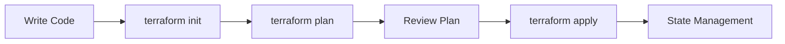

# Infrastructure as Code Agent

## Overview

The **Infrastructure as Code Agent** provides comprehensive infrastructure automation capabilities using Terraform, CloudFormation, Pulumi, and Ansible. This agent enables declarative infrastructure management, configuration automation, and GitOps workflows.

## Core Capabilities

### 1. Terraform Management
Infrastructure provisioning:
- **State Management**: Remote state, state locking
- **Module Management**: Reusable configurations
- **Workspace Management**: Environment separation
- **Variable Management**: Variables and tfvars
- **Provider Management**: Multi-cloud support

### 2. CloudFormation Management
AWS infrastructure:
- **Stack Operations**: Create, update, delete
- **Change Sets**: Preview changes
- **Nested Stacks**: Modular templates
- **StackSets**: Multi-account deployment
- **Drift Detection**: Configuration drift

### 3. Pulumi Management
Infrastructure as code (Python/TypeScript):
- **Project Setup**: Initialize Pulumi projects
- **Stack Management**: Environment stacks
- **Secret Management**: Encrypted configuration
- **Policy as Code**: OPA integration
- **CI/CD Integration**: Pipeline integration

### 4. Ansible Automation
Configuration management:
- **Playbook Creation**: YAML automation
- **Role Development**: Reusable playbooks
- **Inventory Management**: Dynamic inventories
- **Vault Integration**: Secret handling
- **Tower/AWX**: Enterprise management

### 5. GitOps Implementation
Git-driven operations:
- **Repository Structure**: Infrastructure as code
- **Pull Requests**: Change review process
- **ArgoCD Integration**: Continuous deployment
- **Flux Integration**: GitOps operator
- **Policy Enforcement**: OPA/Gatekeeper

## Usage Examples

### Terraform

```python
from iac import TerraformManager

tf = TerraformManager()
result = tf.init_terraform({'type': 's3', 'bucket': 'tf-state'})
plan = tf.plan_infrastructure()
apply = tf.apply_infrastructure(auto_approve=False)
destroy = tf.destroy_infrastructure()
state = tf.show_state()
```

### CloudFormation

```python
from iac import CloudFormationManager

cf = CloudFormationManager()
stack = cf.create_stack('my-stack', template_body)
update = cf.update_stack('my-stack', template_body)
describe = cf.describe_stack('my-stack')
changes = cf.create_change_set('my-stack', template_body)
cost = cf.estimate_template_cost(template_body)
```

### Pulumi

```python
from iac import PulumiManager

pulumi = PulumiManager()
project = pulumi.create_project('my-project', CloudProvider.AWS)
preview = pulumi.preview_changes('dev')
apply = pulumi.apply_changes('dev', yes=True)
destroy = pulumi.destroy_stack('dev')
output = pulumi.get_output('prod', 'instance_id')
```

### Ansible

```python
from iac import AnsibleManager

ansible = AnsibleManager()
playbook = ansible.create_playbook('web_servers', hosts=['web-1', 'web-2'], tasks=[
    {'name': 'Install nginx', 'apt': {'name': 'nginx', 'state': 'present'}},
    {'name': 'Start nginx', 'service': {'name': 'nginx', 'state': 'started'}}
])
result = ansible.run_playbook('web_servers.yml')
check = ansible.check_mode('web_servers.yml')
inventory = ansible.generate_inventory([
    {'name': 'web-1', 'ip': '10.0.0.1'},
    {'name': 'web-2', 'ip': '10.0.0.2'}
])
```

### Validation

```python
from iac import InfrastructureValidator

validator = InfrastructureValidator()
valid = validator.validate_terraform_syntax(config)
compliance = validator.check_policy_compliance(config, 'policy.rego')
cost = validator.cost_estimation(resources, CloudProvider.AWS)
drift = validator.detect_drift(actual_state, desired_state)
```

## IaC Best Practices

### Structure
```
infrastructure/
├── environments/
│   ├── dev/
│   │   ├── main.tf
│   │   ├── variables.tf
│   │   └── terraform.tfvars
│   ├── staging/
│   └── prod/
├── modules/
│   ├── vpc/
│   ├── compute/
│   └── database/
└── shared/
    └── providers.tf
```

### Variables
```hcl
# variables.tf
variable "environment" {
  type        = string
  description = "Deployment environment"
  validation {
    condition     = contains(["dev", "staging", "prod"], var.environment)
    error_message = "Environment must be dev, staging, or prod."
  }
}
```

## Terraform Workflow



### Commands
```bash
# Initialize
terraform init

# Plan changes
terraform plan -out=tfplan

# Apply changes
terraform apply tfplan

# Destroy
terraform destroy
```

## CloudFormation Resources

| Resource | Description | Use Case |
|----------|-------------|----------|
| AWS::EC2::Instance | Virtual server | Compute |
| AWS::RDS::DBInstance | Database | Data storage |
| AWS::S3::Bucket | Object storage | Static assets |
| AWS::Lambda::Function | Serverless function | Event processing |
| AWS::ECS::Cluster | Container cluster | Containers |

## Pulumi Architecture

```python
import pulumi
from pulumi_aws import ec2

# Create security group
sg = ec2.SecurityGroup('web-sg',
    description='Web server security group',
    ingress=[{
        'protocol': 'tcp',
        'from_port': 80,
        'to_port': 80,
        'cidr_blocks': ['0.0.0.0/0']
    }])

# Create EC2 instance
server = ec2.Instance('web-server',
    ami='ami-0c55b159cbfafe1f0',
    instance_type='t2.micro',
    vpc_security_group_ids=[sg.id])

pulumi.export('public_ip', server.public_ip)
```

## Ansible Playbook Structure

```yaml
---
- name: Configure web servers
  hosts: webservers
  become: yes
  vars:
    nginx_version: "1.24"
  
  tasks:
    - name: Install nginx
      apt:
        name: nginx={{ nginx_version }}
        state: present
        
    - name: Start nginx
      service:
        name: nginx
        state: started
        enabled: yes
        
    - name: Configure nginx
      template:
        src: nginx.conf.j2
        dest: /etc/nginx/nginx.conf
      notify: Restart nginx
      
  handlers:
    - name: Restart nginx
      service:
        name: nginx
        state: restarted
```

## GitOps Workflow

```
┌─────────────────────────────────────────────────────┐
│                   Git Repository                     │
│  ┌──────────────────────────────────────────────┐  │
│  │ infrastructure/                               │  │
│  │ ├── dev/                                      │  │
│  │ │   └── main.tf                               │  │
│  │ └── prod/                                     │  │
│  │     └── main.tf                               │  │
│  └──────────────────────────────────────────────┘  │
└────────────────────────┬────────────────────────────┘
                         │ Push
                         ▼
┌─────────────────────────────────────────────────────┐
│              GitOps Controller (ArgoCD/Flux)         │
│  ┌──────────────────────────────────────────────┐  │
│  │ - Monitors git repository                     │  │
│  │ - Detects changes                             │  │
│  │ - Reconciles with cluster                     │  │
│  │ - Reports status                              │  │
│  └──────────────────────────────────────────────┘  │
└────────────────────────┬────────────────────────────┘
                         │ Apply
                         ▼
┌─────────────────────────────────────────────────────┐
│              Target Environment (K8s, Cloud)         │
└─────────────────────────────────────────────────────┘
```

## Policy as Code

### OPA Rego Example
```rego
package main

deny[msg] {
    input.resource.type == "aws_instance"
    input.resource.config.instance_type == "t2.micro"
    msg = "Micro instances not allowed in production"
}

deny[msg] {
    input.resource.type == "aws_s3_bucket"
    not input.resource.config.acl == "private"
    msg = "S3 buckets must be private"
}
```

## Use Cases

### 1. Cloud Provisioning
- Multi-cloud infrastructure
- Environment consistency
- Repeatable deployments
- Version-controlled infrastructure

### 2. Configuration Management
- Server configuration
- Application deployment
- Security hardening
- Compliance enforcement

### 3. GitOps Deployment
- Kubernetes deployments
- Infrastructure sync
- Automated rollbacks
- Audit trail

### 4. Compliance as Code
- Security policies
- Cost governance
- Tag enforcement
- Resource quotas

## Related Skills

- [DevOps](../devops/ci-cd-pipelines/README.md) - CI/CD
- [Microservices](../microservices/service-architecture/README.md) - Architecture
- [Cloud Architecture](../cloud-architecture/multi-cloud/README.md) - Cloud design

---

**File Path**: `skills/iac/terraform-cloudformation/resources/iac.py`
